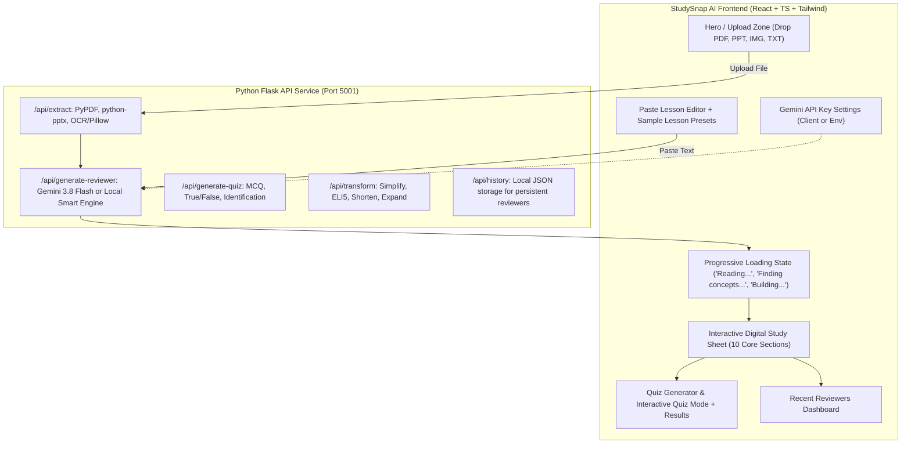

# Implementation Plan - StudySnap AI

StudySnap AI is a modern, student-friendly web application that converts learning materials (PDFs, PPT/PPTX slides, textbook images/diagrams, and lecture notes) into high-yield, exam-focused digital study sheets, interactive flashcard keywords, comparison tables, step-by-step procedures, and customizable practice quizzes.

## User Review Required

> [!NOTE]
> **API Key & Fallback Engine**: The application natively supports **Google Gemini 3.8 Flash** via the modern `google-genai` SDK for multimodal extraction and deep reasoning. We also provide a **Local Smart Engine** fallback so that students can immediately use the app, test sample lectures, upload files, and generate reviewers even before configuring a Gemini API key.
>
> **Stack Architecture**: 
> - **Backend**: Python (Flask + Flask-CORS + PyPDF + Python-PPTX + Pillow + Google-GenAI SDK)
> - **Frontend**: React 18 + TypeScript + Vite + Tailwind CSS + Lucide-React for an academic, modern, mobile-responsive UI.

## Architecture Overview

---

## Proposed Changes

### Backend Service (`backend/`)

#### [NEW] `backend/app.py`
- Flask application setup with CORS, health check, and error handlers.
- REST endpoints:
  - `POST /api/extract`: Multi-part file upload parsing for `.pdf`, `.pptx`, `.ppt`, `.png`, `.jpg`, `.jpeg`, `.txt`.
  - `POST /api/generate-reviewer`: Generates structured reviewer according to the 10-section format with compression level controls (`quick`, `standard`, `detailed`) and tone (`standard`, `simpler`, `eli5`).
  - `POST /api/generate-quiz`: Generates quiz questions (MCQ, True/False, Identification) tailored to the source material.
  - `POST /api/transform`: On-the-fly simplification or compression of existing sections.
  - `GET /api/history` and `POST /api/history`: Save and retrieve past study sessions.

#### [NEW] `backend/extractors.py`
- Robust extraction handlers:
  - `extract_from_pdf`: Page-by-page extraction using `pypdf`, preserving headings, sections, and slide transitions.
  - `extract_from_pptx`: Slide title, body text, table content, and speaker notes extraction via `python-pptx`.
  - `extract_from_image`: Extracts visual details, base64 formatting for Gemini Multimodal API, image metadata, and diagram detection.
  - `extract_from_txt`: Clean plain text normalizer.

#### [NEW] `backend/ai_engine.py`
- Gemini 3.8 Flash integration using `google-genai` SDK:
  - Strict prompts enforcing the 10-section structure:
    1. Quick Review (3-7 bullets)
    2. Keywords (concise definitions)
    3. Core Concepts (bite-sized bullet points)
    4. Must Remember (high-yield exam facts & rules)
    5. Compare (matrix of differences)
    6. Process / Steps (numbered sequence)
    7. Formulas / Rules (equations, variables, usage)
    8. Examples (short, intuitive real-world cases)
    9. Possible Quiz Points (exam-worthy facts)
    10. One-Minute Review (lightning speed recap)
  - Multimodal support: sends uploaded image / diagram directly to Gemini 3.8 Flash with instructions to interpret charts, formulas, diagrams, and handwritten notes.
  - Built-in heuristic local fallback engine when API key is not present or offline, ensuring zero downtime.

---

### Frontend Application (`frontend/`)

#### [NEW] `frontend/package.json` & `frontend/vite.config.ts`
- Vite + React + TypeScript setup with Tailwind CSS, Lucide icons, and canvas-confetti for quiz celebration.

#### [NEW] `frontend/src/types/reviewer.ts`
- Complete TypeScript data interfaces for Reviewer, Keywords, Concepts, Comparisons, Formulas, Processes, Quiz, and History.

#### [NEW] `frontend/src/components/`
- `FileUploader.tsx`: Drag-and-drop zone with animated icons, file type badges, progress indicator, and file preview.
- `TextInput.tsx`: Clean text area with character counter, "Clear", and "Load Sample Lesson" (e.g. Operating Systems / Photosynthesis / Database Normalization).
- `ProcessingState.tsx`: Animated multi-step progress bar showing:
  - "Reading your lesson..."
  - "Finding the important concepts..."
  - "Building your reviewer..."
- `Reviewer.tsx`: Digital study sheet UI featuring:
  - Sticky navigation bar with quick jumps to the 10 sections
  - Interactive search bar with instant highlight
  - Compression switcher: Quick | Standard | Detailed
  - Quick actions: "Make it simpler", "Explain like I'm new to this", "Download PDF", "Copy All", "Generate Quiz"
- `KeywordCard.tsx`: Term pill with definition popup / flashcard mode and star-to-save.
- `ConceptCard.tsx`: Clean card with priority badges and bullet points.
- `ComparisonTable.tsx`: Responsive side-by-side comparison table.
- `FormulaCard.tsx`: Formula notation card with variable breakdown and when-to-use badges.
- `QuizGenerator.tsx`: Modal to configure question count (5, 10, 15) and question types (Multiple Choice, True/False, Identification, Mixed).
- `QuizModal.tsx` & `QuizResults.tsx`: Interactive test session with score animation, answer explanations, and "Topics to review again" tags.
- `ReviewerHistory.tsx`: Dashboard displaying recent reviewers with slide count, date, and 1-click restore.
- `ApiKeyModal.tsx`: Modal to input/save Gemini API key with testing button and security note.

---

## Verification Plan

### Automated Tests
1. Test Python backend dependencies and endpoints:
   - Extract sample PDF, PPTX, and TXT files.
   - Test reviewer generation endpoint with both local fallback and Gemini API.
   - Test quiz generation endpoint.
2. Build frontend production bundle:
   - `npm run build` in `frontend` directory to verify TypeScript types and bundle integrity.

### Manual Verification
1. Open the web application in browser (`http://localhost:5173`).
2. Test pasting a sample lecture (e.g., Computer Science / Biology / Physics) and verify all 10 reviewer sections render cleanly with cards, comparison tables, and formulas.
3. Test uploading a PDF document and PPTX presentation.
4. Test switching between Quick, Standard, and Detailed compression.
5. Test "Make it simpler" and "Explain like I'm new to this".
6. Test Quiz generation, taking the quiz, and viewing score + "Topics to review again".
7. Test Download as PDF / Print view and Copy Reviewer.
8. Test Reviewer History dashboard saving and loading.

